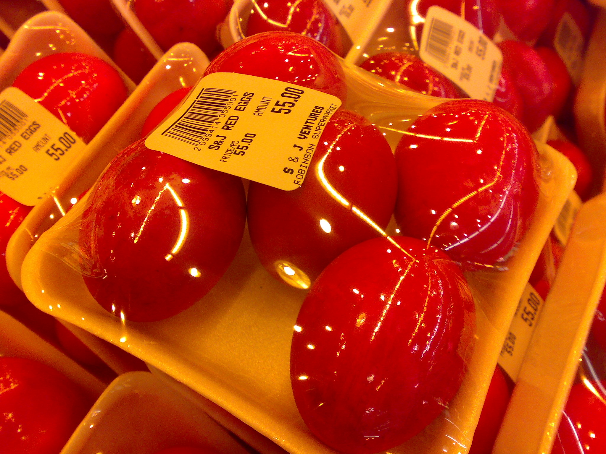

This is my first post on my new fake blog! How exciting!

I'm sure I'll write a lot more interesting things in the future.

Oh, and here's a great quote from this Wikipedia on
[salted duck eggs](http://en.wikipedia.org/wiki/Salted_duck_egg).

> A salted duck egg is a Chinese preserved food product made by soaking duck
> eggs in brine, or packing each egg in damp, salted charcoal. In Asian
> supermarkets, these eggs are sometimes sold covered in a thick layer of salted
> charcoal paste. The eggs may also be sold with the salted paste removed,
> wrapped in plastic, and vacuum packed. From the salt curing process, the
> salted duck eggs have a briny aroma, a gelatin-like egg white and a
> firm-textured, round yolk that is bright orange-red in color.



```jsx
const x = () => <div>test</div>;
```

```js
document.querySelector('#seeMore').click();
document.querySelector('#requestAccountActivityDetailsLink').click();

const keys = ['principal', 'interest', 'escrow', 'fee'];
var out = [];
var list = document.querySelectorAll('tbody > tr');
list.forEach(el => {
  const date = new Date(el.querySelector('.date').innerText).toLocaleDateString();
  const line = { date };
  for (let i = 0; i < keys.length; i++) {
    line[keys[i]] = parseFloat(
      el
        .querySelector('dl.loan-detail')
        .children[i].innerText.replace(',', '')
        .replace('$', '')
        .replace('−', '-')
        .match(/\-?([\d\.]+\d|\d)/)[0]
    );
  }
  out.push(line);
});
var csv = 'date,principal,interest,escrow,fee\n';
out.reverse().forEach(line => {
  csv += `${date},${line.principal},${line.interest},${line.escrow},${line.fee}\n`;
});
```
